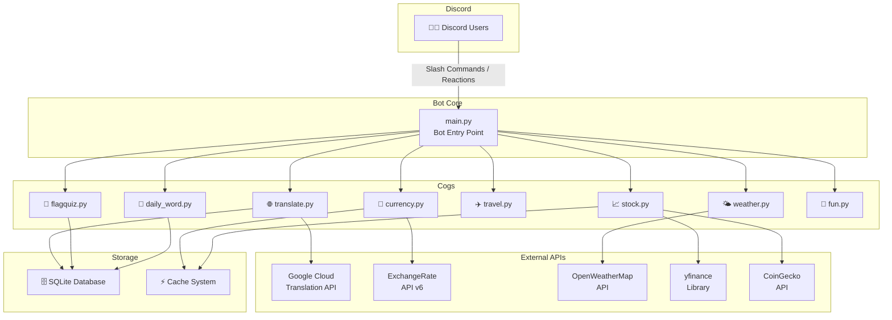

# 🏓 PongPong Bot - 蓬蓬翻譯小幫手

<!-- Badges -->


---

## 📖 簡介 | Description

**PongPong Bot** 是一款功能豐富的 Discord 機器人，專為多語言社群打造。
它整合了即時翻譯、匯率換算、股市追蹤、天氣查詢、旅遊助手等實用功能，
並提供國旗猜謎遊戲和每日單字推送，讓你的 Discord 伺服器更加有趣又實用！

**PongPong Bot** is a feature-rich Discord bot built for multilingual communities.
It integrates real-time translation, currency exchange, stock tracking, weather forecasts,
travel assistance, flag quiz games, and daily word push notifications — making your
Discord server more fun and productive!

---

## ✨ 功能列表 | Features

| Emoji | Feature | Description |
|-------|---------|-------------|
| 🌐 | **Multi-language Translation** | Powered by Google Cloud Translation API, supports 100+ languages with emoji-reaction triggers |
| 💱 | **Real-time Currency Exchange** | Live exchange rates via ExchangeRate-API v6, supports 14+ currencies |
| 📈 | **Stock & Crypto Market Tracking** | Taiwan stocks, US stocks, and crypto prices via yfinance & CoinGecko |
| 🌤️ | **Weather Forecast** | Current weather and forecasts via OpenWeatherMap API |
| ✈️ | **Travel Assistant** | Country info, travel tips, and destination recommendations |
| 🏁 | **Flag Quiz Game** | Fun interactive flag guessing game with leaderboard |
| 📅 | **Daily Word Push** | Automated multilingual vocabulary push notifications |
| 🎲 | **Dice & Pick** | Random dice rolls and pick-one-from-list utilities |

---

## 🏗️ 系統架構 | Architecture



---

## 📋 斜線指令表 | Slash Commands

| Command | Description | Example |
|---------|-------------|---------|
| `/translate` | 翻譯文字到指定語言 | `/translate text:Hello target:zh-TW` |
| `/currency` | 即時匯率轉換 | `/currency amount:1000 from:JPY to:TWD` |
| `/stock` | 查詢股票即時報價 | `/stock code:2330` |
| `/crypto` | 查詢加密貨幣價格 | `/crypto coin:BTC` |
| `/weather` | 查詢天氣預報 | `/weather city:Tokyo` |
| `/travel` | 旅遊資訊查詢 | `/travel country:Japan` |
| `/flagquiz` | 開始國旗猜謎遊戲 | `/flagquiz` |
| `/flagrank` | 查看國旗猜謎排行榜 | `/flagrank` |
| `/dailyword` | 設定每日單字推送 | `/dailyword lang:ja` |
| `/dice` | 擲骰子 | `/dice sides:6 count:2` |
| `/pick` | 從選項中隨機選一個 | `/pick options:火鍋,拉麵,壽司` |

---

## 🚀 安裝與設定 | Installation & Setup

### Prerequisites

- Python 3.11+
- Discord Bot Token ([Discord Developer Portal](https://discord.com/developers/applications))
- Google Cloud Translation API credentials
- ExchangeRate-API key ([exchangerate-api.com](https://www.exchangerate-api.com/))

### Quick Start

```bash
# 1. Clone the repository
git clone https://github.com/Hijiri/PongPong.git
cd PongPong/bot

# 2. Install dependencies
pip install -r requirements.txt

# 3. Copy environment template and fill in your values
cp .env.example .env
# Edit .env with your API keys and tokens

# 4. Run the bot
python main.py
```

---

## 🐳 Docker Deployment

```bash
# Build and run with Docker Compose
docker-compose up -d

# View logs
docker-compose logs -f pongpong-bot

# Stop the bot
docker-compose down
```

---

## 🔑 環境變數 | Environment Variables

| Variable | Required | Description |
|----------|----------|-------------|
| `DISCORD_TOKEN` | ✅ | Discord Bot Token |
| `GOOGLE_APPLICATION_CREDENTIALS_JSON` | ✅ | Google Cloud service account JSON content |
| `CURRENCY_API_key` | ✅ | ExchangeRate-API v6 API key |
| `OPENWEATHER_API_KEY` | ⬜ | OpenWeatherMap API key |
| `DATABASE_PATH` | ⬜ | SQLite database path (default: `data/pongpong.db`) |
| `LOG_LEVEL` | ⬜ | Logging level (default: `INFO`) |

---

## 📁 專案結構 | Project Structure

```
PongPong/bot/
├── main.py                 # 機器人入口點 Bot entry point
├── bot.py                  # Legacy bot (single-file version)
├── keep_alive.py           # Health check web server
├── requirements.txt        # Python dependencies
├── Dockerfile              # Docker image definition
├── docker-compose.yml      # Docker Compose config
├── .env.example            # Environment variable template
├── .gitignore              # Git ignore rules
├── README.md               # This file
├── cogs/                   # Cog modules
│   ├── __init__.py
│   ├── translate.py        # 🌐 Translation commands
│   ├── currency.py         # 💱 Currency exchange
│   ├── stock.py            # 📈 Stock & crypto tracking
│   ├── weather.py          # 🌤️ Weather forecast
│   ├── travel.py           # ✈️ Travel assistant
│   ├── flagquiz.py         # 🏁 Flag quiz game
│   ├── daily_word.py       # 📅 Daily word push
│   └── fun.py              # 🎲 Dice & pick utilities
├── utils/                  # Shared utilities
│   ├── __init__.py
│   ├── database.py         # SQLite async helper
│   ├── cache.py            # Caching utilities
│   └── embeds.py           # Embed builder helpers
├── data/                   # Runtime data (gitignored)
│   └── pongpong.db         # SQLite database
├── logs/                   # Log files (gitignored)
├── tests/                  # Test suite
│   ├── __init__.py
│   ├── test_translate.py   # Translation tests
│   ├── test_currency.py    # Currency tests
│   └── test_stock.py       # Stock tests
└── .github/
    └── workflows/
        └── ci.yml          # GitHub Actions CI
```

---

## 🛠️ Tech Stack

| Category | Technology |
|----------|-----------|
| Language | Python 3.11+ |
| Framework | discord.py 2.x (app_commands) |
| Translation | Google Cloud Translation API v2 |
| Currency | ExchangeRate-API v6 |
| Stock Data | yfinance |
| Crypto Data | CoinGecko API |
| Weather | OpenWeatherMap API |
| Database | SQLite + aiosqlite |
| Testing | pytest + pytest-asyncio |
| CI/CD | GitHub Actions |
| Deployment | Render / Docker |
| Web Server | Flask (health check) |

---

## 🤝 Contributing

Contributions are welcome! Please follow these steps:

1. **Fork** the repository
2. **Create** a feature branch (`git checkout -b feature/amazing-feature`)
3. **Commit** your changes (`git commit -m 'Add amazing feature'`)
4. **Push** to the branch (`git push origin feature/amazing-feature`)
5. **Open** a Pull Request

### Guidelines

- Follow PEP 8 style guide (max line length: 120)
- Add Chinese comments where helpful for readability
- Write tests for new features
- Use `discord.Embed` for all slash command responses
- Use async/await patterns throughout

---

## 📜 License

This project is licensed under the **MIT License** — see the [LICENSE](LICENSE) file for details.

---

## 👤 Author

**Hijiri**

---

<p align="center">
  Made with ❤️ for multilingual Discord communities
</p>
